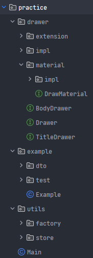

# xchart와 pdfbox 라이브러리를 사용하여 pdf 출력물 만드는 예제

---

## 1. 사용한 라이브러리

- [pdfbox](https://github.com/apache/pdfbox)
  - pdf low level 라이브러리.
- [easytable](https://github.com/vandeseer/easytable)
  - apache.pdfbox 확장 라이브러리. 
  - pdfbox 공식 문서에서 안내하고 있는 확장 라이브러리들 중 star 수, 코드스타일(빌더패턴) 고려하여 사용.
- [XChart](https://github.com/knowm/XChart)
  - 차트(그래프) 추가를 위한 라이브러리. 
  - jfreechart와 비교하였으며, star 수 및 차트 디자인이 좀 더 현대적이여서 사용. 

## 2. 패키지 설명



### drawer

- 예제파일을 위한 클래스 모음.
- 패키지 구조
  - `extension` :  `org.vandeseer.easytable` 라이브러리에 기능을 확장하기 위한 상속 객체 패키지
  - `impl` : 인터페이스 구현체 패키지. 비즈니스 로직에 의존되어 있다.
  - `material` 
    - `impl` : 데이터 객체 인터페이스를 상속한 실제 데이터 객체. 비즈니스 로직에 의존되어 있다.
    - `DrawMaterial.java` : drawer 구현체들이 사용하는 데이터 객체 인터페이스 
  - `BodyDrawer.java` : PDF에 내용(줄글)을 만드는 인터페이스
  - `Drawer.java` : 기본 인터페이스
  - `TitleDrawer.java` : PDF에 제목을 만드는 인터페이스

### example

- 예제파일 실제 구현 테스트 클래스
- 최종 보고서는 `Example.java` 파일을 실행하면 볼 수 있다.

### utils

- 의존성 없이 사용할 유틸리티 클래스. 
- 비즈니스 로직과 의존성 없다.

## 3. 사용

### 1) Java Project

- java 8

[Main 클래스](src/main/java/jy/practice/Main.java) 의 main 메서드 실행시 `./outputs/exmaple.pdf` 파일 생성됨

### 2) Springboot Project

- java 8
- springboot 2.7.14

[Download API(GET, http://localhost:8080/download)](src/main/java/jy/practice/DownloadController.java) 사용 시 웹 다운로드 진행됨

## 4. 한계점

### 1) 확장 및 사용성

해당 프로젝트의 실제 구현체들은 비즈니스 로직에 의존되어 있다. 실제 작업은 `org.vandeseer.easytable`를 사용하며 추가로 필요한 객체들은 확장 및 인터페이스를 통해 추가로 구현하였다.
`~~~Drawer.java` 객체를 통해 코드 작성의 흐름을 파악하여 추후 프로젝트에 활용할 예정이다.

### 2) legacy version

사용한 java 및 라이브러리들의 버전이 `java 8` 버전에 맞추어져 있다. (프로젝트 PoC라서 java 8 버전을 사용함)

- build.gradle
  ```groovy
  // pdf
  implementation 'org.apache.pdfbox:pdfbox:2.0.24'
  // pdf-table
  implementation 'com.github.vandeseer:easytable:0.8.5'
  // chart
  implementation ('org.knowm.xchart:xchart:3.8.8') {
      exclude group: 'org.apache.pdfbox', module: 'pdfbox'
  }
  ```
  - 최신 com.github.vandeseer:easytable 는 1.x 버전이며, java 11 ~, pdfbox 3.0.1 ~ 지원함.
    - 현재는 java 8을 사용한 PoC이기 때문에 버전을 낮춤
  - xchart 3.8.8 버전은 pdfbox:3.0.1 버전을 import 해오기 때문에 제거
